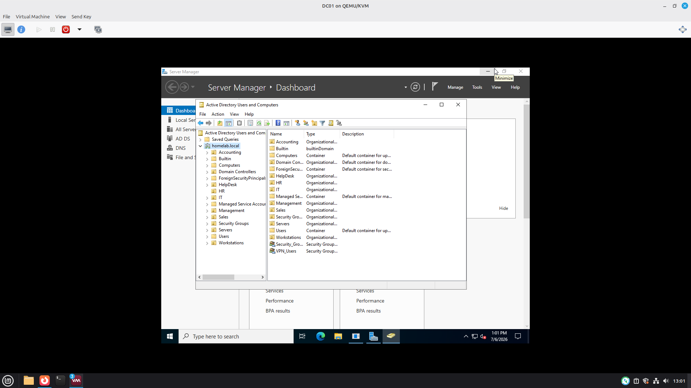
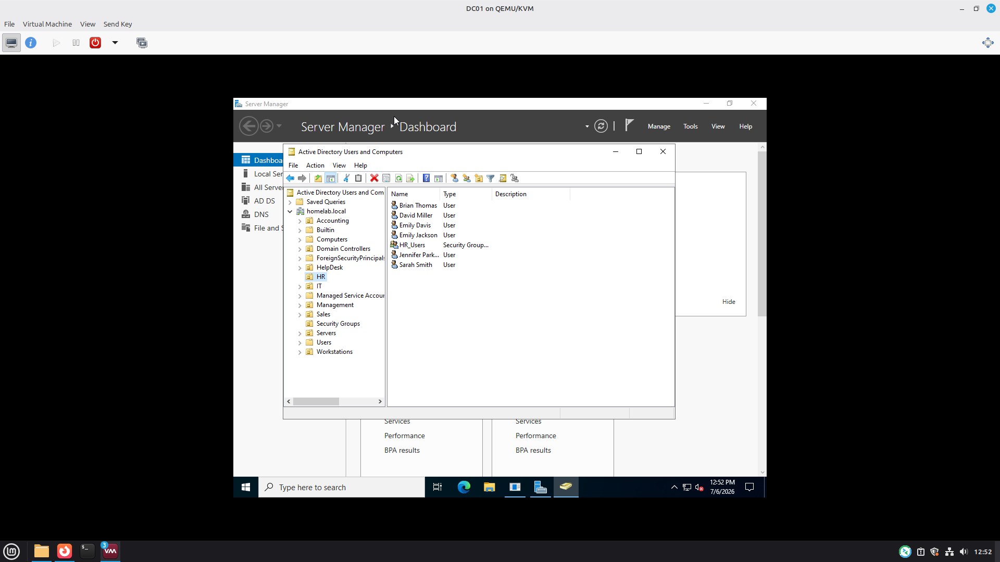
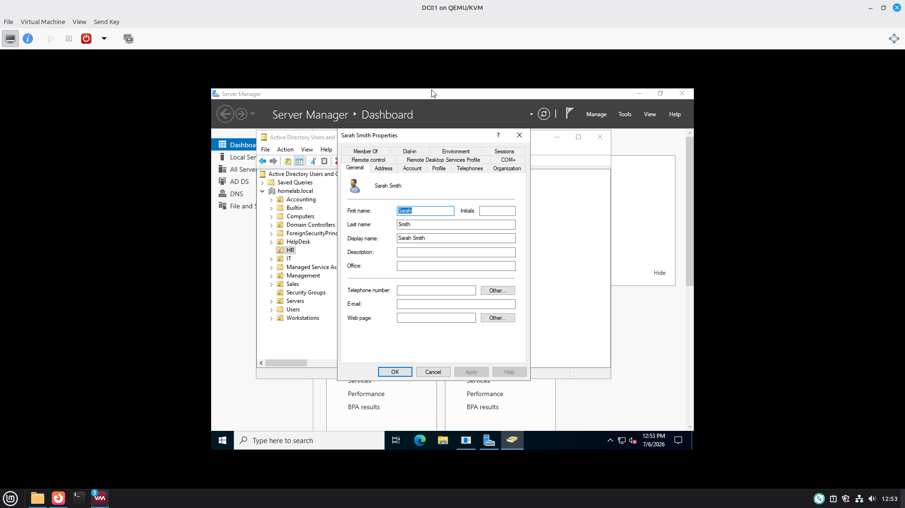
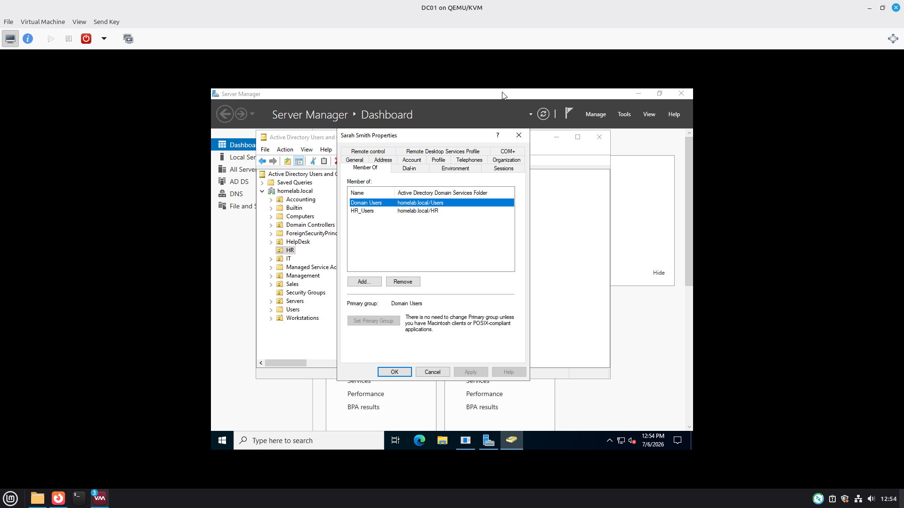

# IT Administrator Labs

Welcome to my Windows Server and Active Directory lab portfolio.

This repository showcases hands-on IT administration projects that simulate real-world enterprise environments. Each project includes a business scenario, implementation steps, screenshots, troubleshooting, and lessons learned.

# Technologies

- Windows Server 2022
- Active Directory Domain Services (AD DS)
- Active Directory Users and Computers (ADUC)
- DNS
- DHCP
- Group Policy
- PowerShell
- Windows 11

## Projects

- Project 01 - User and Group Management 
- Project 02 - Shared Folder Permissions 
- Project 03 - Password Reset and Account Lockout 
- Project 04 - Group Policy Managemnet 

## Skills Demonstrated

- User Account Administration
- Organizational Unit (OU) Management
- Security Group Administration
- Password Management
- Windows Server Administration
- Active Directory Administration
- Technical Documentation

# Project 01 - Active Directory User & Group Management

## Overview

This project demonstrates core Active Directory administration  tasks performed by Help Desk and Junior System Administrators. The objective was to create an organized Active Directory environment, configure Organizational Units (OUs), create  user accounts, and assign security group memberships following common enterprise practices.

----

## Business Scenario

A company has hired several new employees across multiple departments. As the IT Administrator, I was responsible for organizing Active Directory, creating user accounts, assigning users to the appropiate departments, and managing security group mamberships.

----

## Environment

- Windows Server 2022
- Active Directory Domain Services (AD DS)
- Active Directory Users and Computers (ADUC)
- Windows 11 Client
- Hypervisor: QEMU/KVM

----

## Objectives

- Create Organizational Units (OUs)
- Create Security Groups
- Create User Accounts
- Assign users to Department groups
- Verify group memberships
- Organize Active Directory following standard administrative practices

---

## Tasks Performed

- Created Organizational Units for each department
- Created Global Security Groups
- Created user accounts using a consistant naming convention
- Assigned users to department security groups
- Verified account configurations and group memberships
- Confirmed Active Directory organization was functioning as expected

---

## Skills Demostrated

- Active Directory Administration
- User Account Management
- Organizational Units (OU) Management
- Security Group Administration
- Windows Server Administration
- Technical Documentation

---

## Screenshots

### Organizational Unit Structure

### Security Groups

### User Acounts

### Group Memberships

## Conclusion

This project demosrtates core Active Directory administration skills including Organizational Unit (OU) design, user account creation, security group management, and group membership verification. These are common day-to-day responsibilities performed by Help Desk and Junior System Administrators in Windows environments.
